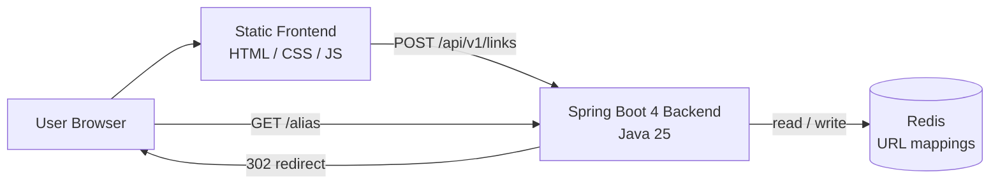
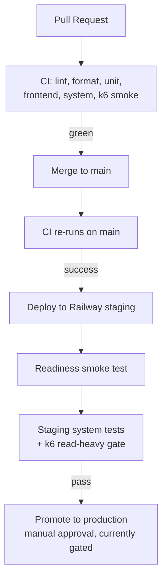

# fold.link

A minimal, fast URL shortener. No accounts, no tracking — paste a long URL,
get a short one back, and every visit to that short link is redirected to the
original destination.


## What it can do

- **Shorten a URL** — submit any `http`/`https` URL and receive a short link
  backed by an 8-character, unguessable, `SecureRandom`-generated alias.
- **Redirect** — visiting `https://<host>/{alias}` issues a `302 Found` to the
  original destination (302, not 301, so browsers and CDNs don't cache the
  mapping).
- **Reject bad input** — malformed URLs and non-`http(s)` schemes are refused
  with a clear `400 VALIDATION_ERROR`; unknown aliases return `404`.
- **Stay up under read-heavy load** — the system is designed and load-tested for
  a workload where redirects vastly outnumber creations.
- **Survive restarts** — mappings are persisted, so short links keep working
  across restarts and redeploys.
- **Copy in one click** — the web UI renders the short link with a
  copy-to-clipboard button and is keyboard-accessible.

The web UI is served by the backend itself at `/`. There is no separate
frontend deployment.

## API

| Method & path | Purpose | Success | Errors |
| --- | --- | --- | --- |
| `POST /api/v1/links` | Create a short link. Body: `{ "url": "<destination>" }` | `201` with `{ alias, shortUrl, destination }` | `400 VALIDATION_ERROR`, `503 STORAGE_ERROR` |
| `GET /{alias}` | Redirect to the destination | `302 Found` with `Location` header | `404 ALIAS_NOT_FOUND`, `503 STORAGE_ERROR` |
| `GET /actuator/health` | Liveness/readiness (readiness fails if Redis is unavailable) | `200`/`503` | — |

Every error response shares the same shape: `{ "error": "<CODE>", "message":
"<safe message>" }`. The absolute `shortUrl` is always built from the
configured `app.base-url`, never from request headers, so `Host` /
`X-Forwarded-Host` cannot spoof the public origin.

Example:

```shell
curl -sX POST http://localhost:8080/api/v1/links \
  -H 'content-type: application/json' \
  -d '{"url":"https://example.com/a/very/long/path"}'
# {"alias":"Xk7pQ2mB","shortUrl":"http://localhost:8080/Xk7pQ2mB","destination":"https://example.com/a/very/long/path"}

curl -i http://localhost:8080/Xk7pQ2mB
# HTTP/1.1 302 Found
# Location: https://example.com/a/very/long/path
```

## Architecture



- **Spring Boot 4 backend (Java 25)** — exposes the REST API
  (`POST /api/v1/links`) and the redirect logic (`GET /{alias}`), and serves the
  static frontend.
- **Static frontend (HTML/CSS/JS)** — served directly by the backend from
  `src/main/resources/static/`, keeping the MVP simple and cohesive.
- **Redis** — the primary data store for URL mappings, chosen for in-memory read
  speed (fast redirects) with RDB/AOF persistence so mappings survive restarts.
  Keys are namespaced and versioned as `v1:link:{alias}`.
- **Infisical** — secrets (e.g. Redis credentials) live in Infisical and are
  injected into the runtime environment at deploy time; nothing sensitive is
  committed to the repository.
- **Railway** — hosts the staging and production environments, pulling the
  container image and fetching secrets from Infisical at runtime.

Key decisions are recorded in
[docs/milestones/mvp/adr-001-mvp-technical-decisions.md](docs/milestones/mvp/adr-001-mvp-technical-decisions.md)
and the full design in
[docs/milestones/mvp/design.md](docs/milestones/mvp/design.md). The requirements
this MVP traces back to are in
[docs/milestones/mvp/requirements.md](docs/milestones/mvp/requirements.md).

## Prerequisites

To build, run, and test the project locally you will need:

- **Java 25** (the Gradle wrapper pins Gradle itself)
- **Docker** (for the local Redis service and the container/system tests)
- **Node.js** (for the frontend and system test suites)
- **k6** (for load testing)
- **Infisical CLI** (optional locally — for fetching development secrets)
- **Redis** (provided via Docker Compose; see below)

Tool versions are pinned in [.mise.toml](.mise.toml) and documented in
[docs/milestones/mvp/toolchain.md](docs/milestones/mvp/toolchain.md). With `mise`
installed, `mise install` provisions the pinned Java and Node versions.

## Local development

Small, documented helper scripts live in `scripts/dev/` (none of them ever print
secret values):

| Command | Purpose |
| --- | --- |
| `scripts/dev/redis-start.sh` | Start the Compose Redis service and wait for it to report healthy. |
| `scripts/dev/run.sh` | Run the app with configuration injected by the Infisical CLI (falls back to `.env` instructions if Infisical isn't set up). |
| `scripts/dev/test.sh` | Run the JVM test suite via the pinned Gradle wrapper. |
| `scripts/dev/redis-stop.sh` | Stop Redis (add `--purge-volume` to also delete its data). |

A typical loop from a fresh shell:

```shell
scripts/dev/redis-start.sh   # bring up local Redis
scripts/dev/test.sh          # run unit/integration tests
scripts/dev/run.sh           # start the app on http://localhost:8080
scripts/dev/redis-stop.sh    # tear down when done
```

If you don't use Infisical locally, copy the safe fixture config and load it into
your shell instead:

```shell
cp .env.example .env         # local-only fixture values (not secrets)
set -a && source .env && set +a
./gradlew bootRun
```

Local runtime configuration (Spring profile, Redis host, alias length, base URL,
etc.) is documented inline in [.env.example](.env.example) and typed in
[`AppProperties`](src/main/java/link/fold/config/AppProperties.java).

## Testing

The project has four test layers, each runnable locally and in CI:

| Layer | What it covers | Run it |
| --- | --- | --- |
| **Unit / integration** | Domain logic, validation, the Redis repository (against a disposable Redis), API contracts, per-profile config | `./gradlew test` |
| **Frontend** | The static UI's submit/validation/copy behaviour (jsdom + Node test runner) | `npm run test:frontend` |
| **System** | End-to-end create → redirect → persistence against the built container | `npm run test:system` (or `scripts/system-test.sh <image>`) |
| **Load (k6)** | Redirect, creation, and read-heavy mixed scenarios with latency/error thresholds | `k6 run load-tests/k6/scenarios/mixed.js` |

Formatting is enforced with Spotless (`./gradlew spotlessCheck`) and Markdown
with markdownlint (`npm run lint:md`).

## Development & deployment workflow

CI/CD runs on **GitHub Actions** and deploys to **Railway**. There are three
workflows:

1. **[CI](.github/workflows/ci.yml)** — runs on every pull request and on push
   to `main`: Markdown lint, Spotless formatting check, frontend tests, unit
   tests (with a Redis service container), then a container **system test** and a
   **k6 smoke** test against a freshly built image. System and load jobs only run
   after the faster checks pass, and merges are blocked unless everything is
   green.
2. **[Deploy](.github/workflows/deploy.yml)** — triggered when CI completes
   successfully on `main`. It installs the Railway CLI and runs `railway up` to
   deploy the commit to the **staging** environment, then smoke-tests staging's
   readiness endpoint. The **production** job is defined but currently gated off
   (`if: false`); enabling it — together with required reviewers on the
   `production` GitHub Environment — promotes the same commit to production behind
   a manual approval.
3. **[Staging System Tests](.github/workflows/post-deploy-system-tests.yml)** —
   fires on a successful staging deployment: it re-runs the full system test
   suite against the live staging URL and then a bounded read-heavy **k6 gate**.
   A threshold failure here fails the run and so blocks promotion of that commit.



The day-to-day contributor flow is therefore: branch off `main`, make your
change, run the relevant test layer(s) locally, open a PR, and let CI verify it.
Once merged, staging deploys and is verified automatically; production promotion
is a deliberate, reviewed step. Branch and merge conventions are described in
[docs/milestones/mvp/branch-policy.md](docs/milestones/mvp/branch-policy.md), and
the definition of done in
[docs/milestones/mvp/definition-of-done.md](docs/milestones/mvp/definition-of-done.md).

## Project layout

```text
src/main/java/link/fold/   Spring Boot backend (api, domain, redis, config)
src/main/resources/static/ Static frontend (HTML/CSS/JS)
src/test/java/             JVM unit & integration tests
test/frontend/             Frontend (jsdom) tests
test/system/               End-to-end system tests
load-tests/k6/             k6 load-test scenarios and library
scripts/                   Dev helpers, system-test and CI smoke scripts
docker/                    Container entrypoint (Infisical injection) and fixtures
docs/milestones/mvp/       Requirements, design, ADRs, runbooks, and tickets
.github/workflows/         CI, deploy, and post-deploy test pipelines
```

Operational runbooks (deployment, secret rotation, Redis recovery) live under
[docs/milestones/mvp/](docs/milestones/mvp/).
</content>
