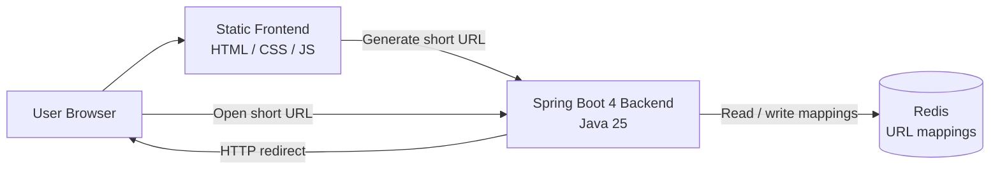
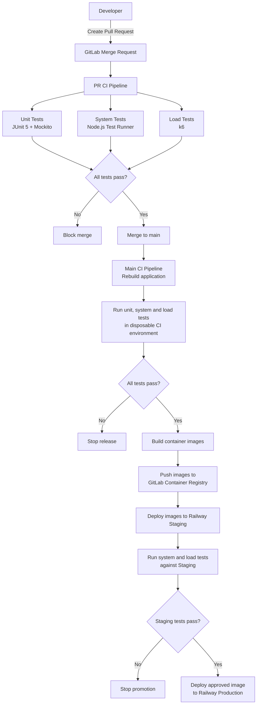

# fold.link - Architecture and Test Plan

## 1. Architectural Overview

### 1.1 Components and Technologies

- **Backend Service**: Developed using Spring Boot 4 and Java 25. It will expose REST APIs for URL generation and handle the HTTP redirection logic.
- **Frontend**: A static web interface (HTML/CSS/JS) served directly by the Spring Boot backend to keep the MVP simple and cohesive.
- **Persistent Storage**: Redis will be used as the primary data store. Redis provides in-memory read speeds (crucial for fast redirections) while offering persistence mechanisms (RDB/AOF) to ensure data is not lost between restarts.

### 1.2 Secrets Management
Sensitive configuration (e.g., Redis credentials, API keys) will be stored in Infisical. 

Railway deployment will fetch these secrets at runtime (e.g., using the Infisical CLI agent to inject environment variables into the container).

### 1.3 Release/Testing Strategy

